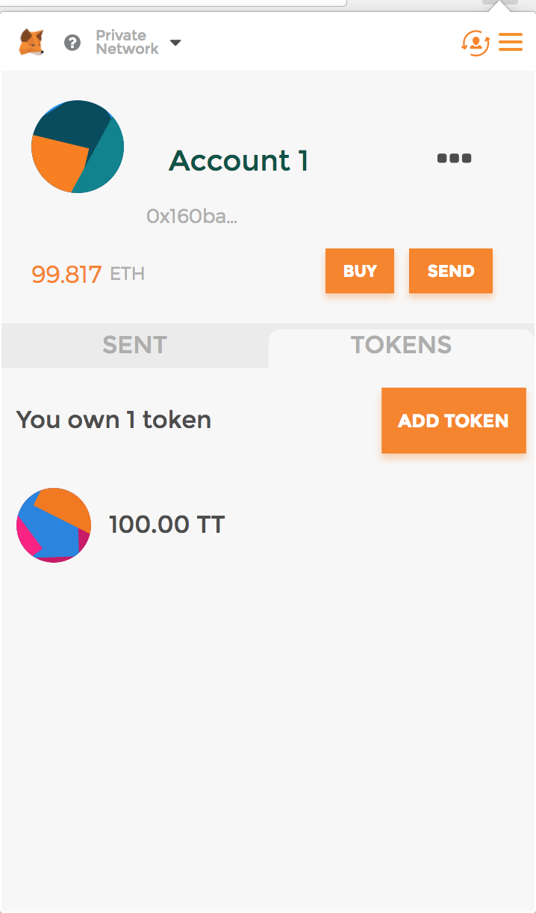
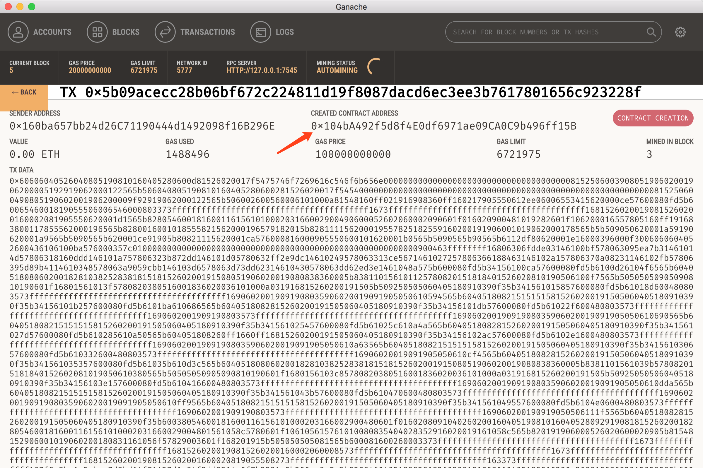

# Learn Ethereum - 如何用15行代码发布 token

[源代码下载](https://github.com/etherchina/ethereum/tree/develop/src/how-to-issue-token)  
[视频回放]()  

## 本文会覆盖以下内容  
- 开发环境的准备参考[如何在以太坊上搭建宠物店](../petstore-truffle.md)  
- 从 Truffle box 创建项目  
- 编写 FakeToken 智能合约  
- 编译部署智能合约  
- 用新的 token 进行转账

## 开发环境的准备
**本地环境Mac**  
这个教程会用到的环境：  
- 开发环境：node.js, npm (本文用到的node version, v9.11.1 npm version v5.6.0)  
- 编译部署环境：truffle (version 4.1.5, solidity 0.4.21)  
- 以太坊私链：ganache (version 1.1.0)  

开发环境的准备操作，可以参考[如何在以太坊上搭建宠物店](https://github.com/etherchina/ethereum/petstore-truffle.md)   

## 创建项目

```
BobJianglocal:truffle bobjiang$ truffle unbox tutorialtoken
```

truffle框架目录介绍：  
- contracts/ ： 智能合约文件存在这里，后缀.sol （solidity）  
- migrations/ ： 部署脚本  
- test/ ： 测试脚本  
- truffle.js ：truffle的配置文件

## 安装OpenZeppelin

```
BobJianglocal:truffle bobjiang$ npm install zeppelin-solidity
```

## 编写智能合约

1. 在 contracts/ 目录下创建 FakeToken.sol 文件，内容如下：  

```
pragma solidity ^0.4.17;

import 'zeppelin-solidity/contracts/token/ERC20/StandardToken.sol';

contract FakeToken is StandardToken {
    string public name = 'FakeToken';
    string public symbol = 'TT';
    uint8 public decimals = 2;
    uint public INITIAL_SUPPLY = 12000;

    function FakeToken() public {
      totalSupply_ = INITIAL_SUPPLY;
      balances[msg.sender] = INITIAL_SUPPLY;
    }
}
```

## 编译部署合约

### 编译合约

```
BobJianglocal:truffle bobjiang$ truffle compile
Compiling ./contracts/FakeToken.sol...
Compiling ./contracts/Migrations.sol...

Writing artifacts to ./build/contracts
```

上面有警告的地方，可以忽略。（原来给的文件里面没有指定函数的可见性）  

### 部署合约
1. 在 migratios/ 目录内创建新文件 2_deploy_contracts.js 内容如下：

```
var FakeToken = artifacts.require("FakeToken");

module.exports = function(deployer) {
  deployer.deploy(FakeToken);
};

```

2. 确保安装好了 [ganache](http://truffleframework.com/ganache)   
安装好后第一次启动的界面如下(借用的源文档图片)  
  
3. 智能合约部署到以太坊（私链）上  
```
BobJianglocal:truffle bobjiang$ truffle migrate
Using network 'development'.

Running migration: 1_initial_migration.js
  Deploying Migrations...
  ... 0x579459f9d2e89ed07356c7565056e082b540c5f441ffcdc1e4676f42536451d5
  Migrations: 0x651ee6754b509e0f3413fcb6c88c6c20dc8c9d28
Saving successful migration to network...
  ... 0xfafeb069ba502196abeabef2c097bdd9e4db9ab02c98a9b98d8db47f7d205a9b
Saving artifacts...
Running migration: 2_deploy_contracts.js
  Deploying Adoption...
  ... 0xaee412f76fe2ed3853f8e138f009cd8fca23835547a39e23188affef55665460
  Adoption: 0x104ba492f5d8f4e0df6971ae09ca0c9b496ff15b
Saving successful migration to network...
  ... 0x9219eeba1a1eb945d4fe1fb1bf6cdb2b70218c22b264134cfd97e2f4dfe026ef
Saving artifacts...
```

部署完成后，可以看到有四笔交易(四个区块)：  
  

## 转账新的 token
### 前端修改

修改默认的RPC port，9545修改为ganache的7545
```
App.web3Provider = new Web3.providers.HttpProvider('http://127.0.0.1:9545');
```

### 修改调用合约的脚本

下面的TutorialToken.json修改为FakeToken.json
```
$.getJSON('TutorialToken.json', function(data) {
```

### 配置 MetaMask 

配置 MetaMask 连接本地 ganache  
具体连接方法[请参考]()  

MetaMask 创建新的账号（会自动添加 ganache 中第二个账号）  

### 启动本地 HTTP 服务器

```
BobJianglocal:truffle bobjiang$ npm run dev
```

自动打开新网页，如下  
  

### 转账

我们新发布的 token 默认存在第一个账户中，我们现在从第一个账户向第二个账户进行转账，来测试我们新的 token  
MetaMask 中选择第一个账户，刷新网页，会显示上述的网页  
第一个输入框，输入第二个账户的地址  
第二个输入框，输入转账金额（这里我们前面的 decimals 设置为 2，则转账金额会截断2位小数）  
点击 “Transfer”  
会弹出如下网页（MetaMask钱包）  
  

点击“Submit”，会收到转账成功的提示  
返回 ganache 查看，新增一笔交易  

进入 MetaMask ，点击第二个账户，然后刷新网页，可以看到第二个账户已经收到了新的 token

### 钱包中显示新 token

1. 打开 MetaMask 钱包，选择第一个账户，点击 TOKENS 标签，如下  
  
2. 输入 token contract address 
3. 在 ganache 中找到创建 token 合约的地址，如下图  
  
4. 输入 token 合约地址后，自动带出 token symbols 和 decimals
5. 点击确认即可

至此，我们在 MetaMask 钱包里，就可以完美显示我们新的 token 了。

转载请注明以下信息：  

有问题、疑问，欢迎到社区提问 -   

## HiBlock介绍
HiBlock 秉承开放、协作、透明、链接、分享的价值观，致力打造一个专注于区块链的开发者社区，我们不仅在开发者中宣传推广区块链，还会帮助开发者真正掌握区块链技术和应用。我们有线上活动（如一起译文档、一起学以太坊、一起学EOS等），有培训课程（提供专业的区块链技术培训 http://hiblock.net/topics/node16 ）、也有线下沙龙聚会（全国各城进行线下交流），还有blockathon（链接全球区块链开发者）。详情参考：https://github.com/HiBlock/hiblock/tree/master/meetup 

[HiBlock社区](hiblock.net)  
[HiBlock github仓库](https://github.com/HiBlock/)  
[EtherChina github仓库](https://github.com/etherchina/)  

## 参考文档  
[BUILDING ROBUST SMART CONTRACTS WITH OPENZEPPELIN](http://truffleframework.com/tutorials/robust-smart-contracts-with-openzeppelin)   