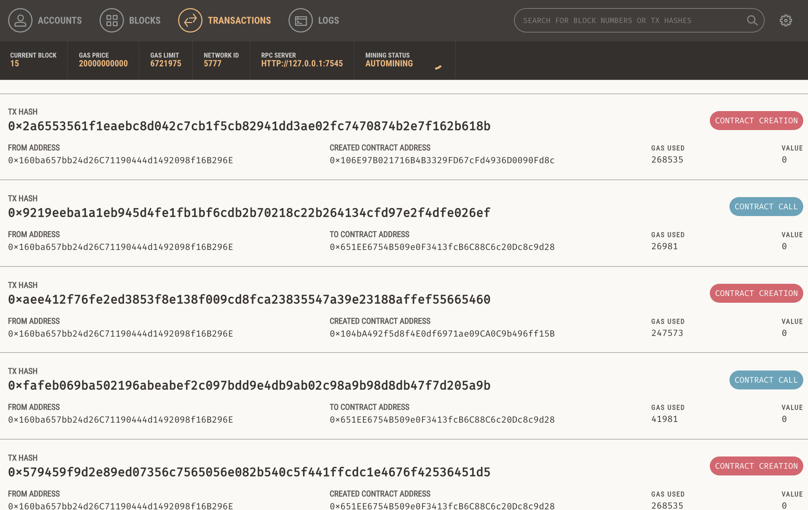
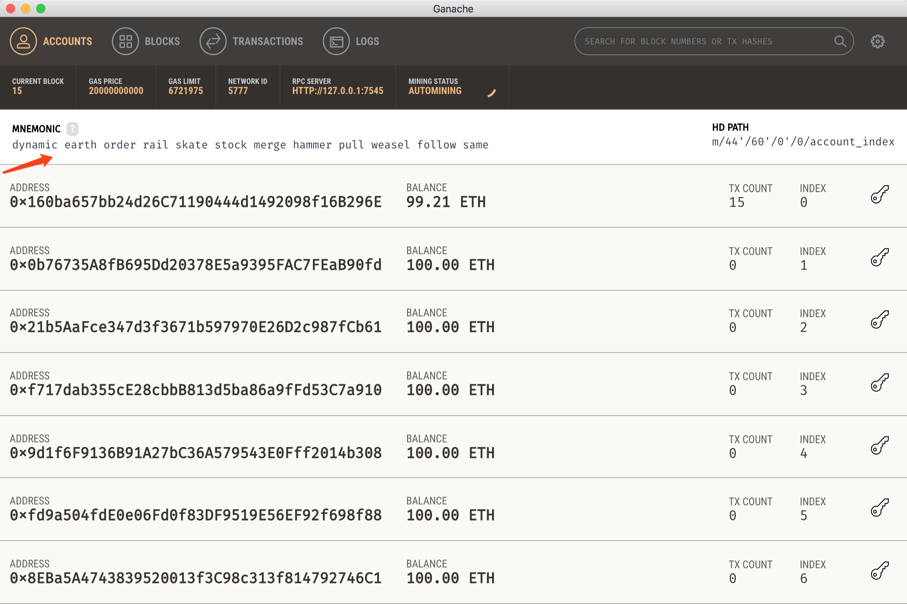

# Learn Ethereum - 如何在以太坊上开一家宠物店

## 本文会覆盖以下内容  
- 开发环境的准备  
- 从Truffle box创建项目  
- 编写智能合约  
- 编译部署智能合约  
- 测试智能合约  
- 创建用户界面并与智能合约交互
- 浏览器中用DAPP进行交互

## 开发环境的准备
**本地环境Mac**  
这个教程会用到的环境：  
- 开发环境：node.js, npm (本文用到的node version, v9.11.1 npm version v5.6.0)  
- 编译部署环境：truffle (version 4.1.5, solidity 0.4.21)  
- 以太坊私链：ganache (version 1.1.0)  

问题：  
> 这里碰到第一个坑，以前安装过老版本node.js，提示必须升级新版本，但总提示：brew link error
> 无法找到：/usr/local/Cellar/  
解决方案：  
> uninstall, install, link 最终解决

### 安装开发环境  

```
BobJianglocal:pet-shop-tutorial bobjiang$ brew uninstall node --force
BobJianglocal:pet-shop-tutorial bobjiang$ brew uninstall npm --force
BobJianglocal:pet-shop-tutorial bobjiang$ brew link node
BobJianglocal:pet-shop-tutorial bobjiang$ brew install node
BobJianglocal:pet-shop-tutorial bobjiang$ 
```

### 安装truffle

```
BobJianglocal:pet-shop-tutorial bobjiang$ npm install -g truffle
```

### 安装ganache
[下载ganache](http://truffleframework.com/ganache)  

## 创建项目

```
BobJianglocal:pet-shop-tutorial bobjiang$ mkdir pet-shop-tutorial
BobJianglocal:pet-shop-tutorial bobjiang$ cd pet-shop-tutorial/
BobJianglocal:pet-shop-tutorial bobjiang$ truffle unbox pet-shop
```

truffle框架目录介绍：  
- contracts/ ： 智能合约文件存在这里，后缀.sol （solidity）  
- migrations/ ： 部署脚本  
- test/ ： 测试脚本  
- truffle.js ：truffle的配置文件

## 编写智能合约

1. 在 contracts/ 目录下创建 Adoption.sol 文件，内容如下：  

```
pragma solidity ^0.4.17;

contract Adoption {
    address[16] public adopters;

    //adopting a pet
    function adopt(uint petId) public returns (uint) {
      require(petId >= 0 && petId <= 15);
      adopters[petId] = msg.sender;
      return petId;
    }

    //retrieve the adopters
    function getAdopters() public view returns (address[16]) {
      return adopters;
    }
}
```

## 编译部署合约

### 编译合约

```
BobJianglocal:pet-shop-tutorial bobjiang$ truffle compile
Compiling ./contracts/Adoption.sol...
Compiling ./contracts/Migrations.sol...

Compilation warnings encountered:

/Users/bobjiang/Documents/hiblock.net/truffle/pet-shop-tutorial/contracts/Migrations.sol:11:3: Warning: No visibility specified. Defaulting to "public".
  function Migrations() {
  ^ (Relevant source part starts here and spans across multiple lines).
,/Users/bobjiang/Documents/hiblock.net/truffle/pet-shop-tutorial/contracts/Migrations.sol:15:3: Warning: No visibility specified. Defaulting to "public".
  function setCompleted(uint completed) restricted {
  ^ (Relevant source part starts here and spans across multiple lines).
,/Users/bobjiang/Documents/hiblock.net/truffle/pet-shop-tutorial/contracts/Migrations.sol:19:3: Warning: No visibility specified. Defaulting to "public".
  function upgrade(address new_address) restricted {
  ^ (Relevant source part starts here and spans across multiple lines).

Writing artifacts to ./build/contracts
```

上面有警告的地方，可以忽略。（原来给的文件里面没有指定函数的可见性）  

### 部署合约
1. 在 migratios/ 目录内创建新文件 2_deploy_contracts.js 内容如下：

```
var Adoption = artifacts.require("Adoption");

module.exports = function(deployer) {
    deployer.deploy(Adoption);
};

```

2. 确保安装好了 [ganache](http://truffleframework.com/ganache)   
安装好后第一次启动的界面如下(借用的源文档图片)  
  
3. 智能合约部署到以太坊（私链）上  
```
BobJianglocal:pet-shop-tutorial bobjiang$ truffle migrate
Using network 'development'.

Running migration: 1_initial_migration.js
  Deploying Migrations...
  ... 0x579459f9d2e89ed07356c7565056e082b540c5f441ffcdc1e4676f42536451d5
  Migrations: 0x651ee6754b509e0f3413fcb6c88c6c20dc8c9d28
Saving successful migration to network...
  ... 0xfafeb069ba502196abeabef2c097bdd9e4db9ab02c98a9b98d8db47f7d205a9b
Saving artifacts...
Running migration: 2_deploy_contracts.js
  Deploying Adoption...
  ... 0xaee412f76fe2ed3853f8e138f009cd8fca23835547a39e23188affef55665460
  Adoption: 0x104ba492f5d8f4e0df6971ae09ca0c9b496ff15b
Saving successful migration to network...
  ... 0x9219eeba1a1eb945d4fe1fb1bf6cdb2b70218c22b264134cfd97e2f4dfe026ef
Saving artifacts...
```

部署完成后，可以看到有四笔交易(四个区块)：  
  

## 测试智能合约
智能合约可以也可以用测试类来进行断言（assert）验证。例如在 test/ 目录内创建新文件 TestAdoption.sol 内容如下：  
```
pragma solidity ^0.4.17;

import "truffle/Assert.sol";
import "truffle/DeployedAddresses.sol";
import "../contracts/Adoption.sol";

contract TestAdoption {
    Adoption adoption = Adoption(DeployedAddresses.Adoption());

    //test adopt() function
    function testUserCanAdoptPet() public {
      uint returnedId = adoption.adopt(8);

      uint expected = 8;

      Assert.equal(returnedId, expected, "Adoption of Pet ID 8 should be recorded.");
    }

    //test retrieve of a single pet owner
    function testGetAdopterAddressByPetId() public {
      //expected owner is this contract
      address expected = this;
      address adopter = adoption.adopters(8);
      Assert.equal(adopter, expected, "owner of pet id 8 should be recorded.");
    }

    //test retrive of all pet owners
    function testGetAdopterAddressByPetIdInArray() public {
      //expected owner is this contract
      address expected = this;
      address[16] memory adopters = adoption.getAdopters();

      Assert.equal(adopters[8], expected, "owner of pet id 8 should be recorded.");
    }
}

```

运行测试，结果如下：  

```
BobJianglocal:pet-shop-tutorial bobjiang$ pwd
/hiblock.net/truffle/pet-shop-tutorial
BobJianglocal:pet-shop-tutorial bobjiang$ truffle test
Using network 'development'.

Compiling ./contracts/Adoption.sol...
Compiling ./test/TestAdoption.sol...
Compiling truffle/Assert.sol...
Compiling truffle/DeployedAddresses.sol...

Compilation warnings encountered:

truffle/Assert.sol:1563:9: Warning: Use of the "var" keyword is deprecated.
        var nstr = _itoa(value, 10);
        ^------^
,truffle/Assert.sol:1580:9: Warning: Use of the "var" keyword is deprecated.
        var nstr = _utoa(value, 10);
        ^------^
,truffle/Assert.sol:1597:9: Warning: Use of the "var" keyword is deprecated.
        var nstr = _ltoa(value);
        ^------^
,truffle/Assert.sol:1347:13: Warning: Invoking events without "emit" prefix is deprecated.
            TestEvent(true, "");
            ^-----------------^
,truffle/Assert.sol:1349:13: Warning: Invoking events without "emit" prefix is deprecated.
            TestEvent(false, message);
            ^-----------------------^


  TestAdoption
    ✓ testUserCanAdoptPet (113ms)
    ✓ testGetAdopterAddressByPetId (103ms)
    ✓ testGetAdopterAddressByPetIdInArray (132ms)

  3 passing (1s)

```

上面Assert.sol里面有警告，var关键词已经不建议使用。忽略掉。

## 开始用户界面的工作
用户界面（UI）是前端工作，这里用的javascript。主要文件是app.js，存在目录 /src/js/app.js 中。文件内容如下：

```
App = {
  web3Provider: null,
  contracts: {},

  init: function() {
    // Load pets.
    $.getJSON('../pets.json', function(data) {
      var petsRow = $('#petsRow');
      var petTemplate = $('#petTemplate');

      for (i = 0; i < data.length; i ++) {
        petTemplate.find('.panel-title').text(data[i].name);
        petTemplate.find('img').attr('src', data[i].picture);
        petTemplate.find('.pet-breed').text(data[i].breed);
        petTemplate.find('.pet-age').text(data[i].age);
        petTemplate.find('.pet-location').text(data[i].location);
        petTemplate.find('.btn-adopt').attr('data-id', data[i].id);

        petsRow.append(petTemplate.html());
      }
    });

    return App.initWeb3();
  },

  initWeb3: function() {
    // Is there an injected web3 instance?
if (typeof web3 !== 'undefined') {
  App.web3Provider = web3.currentProvider;
} else {
  // If no injected web3 instance is detected, fall back to Ganache
  App.web3Provider = new Web3.providers.HttpProvider('http://localhost:7545');
}
web3 = new Web3(App.web3Provider);

    return App.initContract();
  },

  initContract: function() {
    $.getJSON('Adoption.json', function(data) {
  // Get the necessary contract artifact file and instantiate it with truffle-contract
  var AdoptionArtifact = data;
  App.contracts.Adoption = TruffleContract(AdoptionArtifact);

  // Set the provider for our contract
  App.contracts.Adoption.setProvider(App.web3Provider);

  // Use our contract to retrieve and mark the adopted pets
  return App.markAdopted();
});

    return App.bindEvents();
  },

  bindEvents: function() {
    $(document).on('click', '.btn-adopt', App.handleAdopt);
  },

  markAdopted: function(adopters, account) {
    var adoptionInstance;

App.contracts.Adoption.deployed().then(function(instance) {
  adoptionInstance = instance;

  return adoptionInstance.getAdopters.call();
}).then(function(adopters) {
  for (i = 0; i < adopters.length; i++) {
    if (adopters[i] !== '0x0000000000000000000000000000000000000000') {
      $('.panel-pet').eq(i).find('button').text('Success').attr('disabled', true);
    }
  }
}).catch(function(err) {
  console.log(err.message);
});
  },

  handleAdopt: function(event) {
    event.preventDefault();

    var petId = parseInt($(event.target).data('id'));

    var adoptionInstance;

web3.eth.getAccounts(function(error, accounts) {
  if (error) {
    console.log(error);
  }

  var account = accounts[0];

  App.contracts.Adoption.deployed().then(function(instance) {
    adoptionInstance = instance;

    // Execute adopt as a transaction by sending account
    return adoptionInstance.adopt(petId, {from: account});
  }).then(function(result) {
    return App.markAdopted();
  }).catch(function(err) {
    console.log(err.message);
  });
});
  }

};

$(function() {
  $(window).load(function() {
    App.init();
  });
});

```

### 安装配置MetaMask
与Dapp互动的最容易的方式是通过 [MetaMask](https://metamask.io/)  

1. 在浏览器内安装MetaMask
2. 装好后，以Chrome浏览器插件形式存在
3. 同意，接受条款
4. 如下图，点击"Import Existing DEN"
	  
5. 返回 ganache 的主界面，在 Accounts 下有一行12个单词的助记词，如下图  
	  
6. 复制助记词，粘贴到 MetaMask 界面中的 Wallet Seed 文本框中
7. 设置一个密码，点击 OK
8. 点击 MetaMask 左上角的 Main Network ，点击 Custom RPC 
9. 在 New RPC URL 中输入 “http://127.0.0.1:7545”
10. 返回 MetaMask 主界面，可以看到账户信息

> 上面的第六步碰到第二个坑，这里的助记词一定用你的 ganache 私链上的，否则 MetaMask 钱包无法链接到本地的私链，因此无法显示余额

### 安装配置 lite-server
在解开的目录内，有 bs-config.jscon 和 package.json 两个配置文件，不必要修改。（这里定义了lite server，一会儿浏览器访问dapp用）

命令行启动lite-server

```
BobJianglocal:pet-shop-tutorial bobjiang$ npm run dev

> pet-shop@1.0.0 dev /Users/bobjiang/Documents/hiblock.net/truffle/pet-shop-tutorial
> lite-server

** browser-sync config **
{ injectChanges: false,
  files: [ './**/*.{html,htm,css,js}' ],
  watchOptions: { ignored: 'node_modules' },
  server:
   { baseDir: [ './src', './build/contracts' ],
     middleware: [ [Function], [Function] ] } }
[Browsersync] Access URLs:
 ----------------------------------------
       Local: http://localhost:3000
    External: http://192.168.199.126:3000
 ----------------------------------------
          UI: http://localhost:3001
 UI External: http://192.168.199.126:3001
 ----------------------------------------
[Browsersync] Serving files from: ./src
[Browsersync] Serving files from: ./build/contracts
[Browsersync] Watching files...
18.04.08 15:20:02 200 GET /index.html
```

- 打开宠物店： http://localhost:3000  
- 选择一个你喜欢的狗狗，点击 Adopt（领养）  
- MetaMask会自动提示，有一笔交易需要你同意
- 点击 Submit 返回宠物店
- 可能需要刷新页面 http://localhost:3000，就可以看到刚才你领养的那只狗，已经领养成功了。（其他人无法领养）
- 返回 MetaMask 钱包可以看到刚才的领养的交易
- 返回 ganache 也可以看到刚才的这笔交易被打包了

恭喜你，第一个 dapp 搞定啦！

## 参考文档  
[truffle pet shop](http://truffleframework.com/tutorials/pet-shop)   